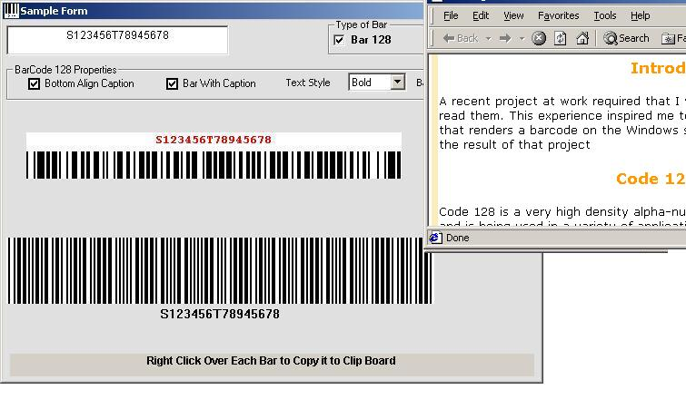



## Barcode Generator \( Code 39 and Code 128 \) with GIF Export  and Documentation

### Description

This a Barcode generator with bar39 and bar128.

THIS BARCODE GENERATOR IS SIMILAR TO INDUSTRY RENOWN PRODUCT 'ACTIVEBARCODE' IN FUNCTIONALITY. I've put detail description of how these codes are generated. If you are a beginner or a novice to Barcode, it helps you to understand the Barcode algorithms I've used.

I've developed it from scratch.

Now with these algorithms, you can create your own barcode and use it in diffrent purposes.

What is barcode ? A barcode is a machine-readable symbol used to encode information in order to automate a business process. Examples of business processes are retail sales, shipping and tracking, inventory management, warehouse management, asset tracking, and automated data entry.

CHECK THE Readme.htm FOR THE DETAIL DESCRIPTION.

----

Update on 12th Dec 2002-> A bug on printing Char '*' on Bar39 is fixed.

----

Update on 11th Oct 2002 -> Export the Barcode to Gif and transperent Gif with completely independent Export Class.

----

 
### More Info
 

             |
---                |---
**Submitted On**   |2002-10-11 18:58:56
**By**             |[joyprakash saikia](https://github.com/Planet-Source-Code/PSCIndex/blob/master/ByAuthor/joyprakash-saikia.md)
**Level**          |Intermediate
**User Rating**    |4.9 (613 globes from 124 users)
**Compatibility**  |VB 5\.0, VB 6\.0
**Category**       |[Libraries](https://github.com/Planet-Source-Code/PSCIndex/blob/master/ByCategory/libraries__1-49.md)
**World**          |[Visual Basic](https://github.com/Planet-Source-Code/PSCIndex/blob/master/ByWorld/visual-basic.md)
**Archive File**   |[Barcode\_Ge1509171272002\.zip](https://github.com/Planet-Source-Code/joyprakash-saikia-barcode-generator-code-39-and-code-128-with-gif-export-and-documentation__1-39531/archive/master.zip)

